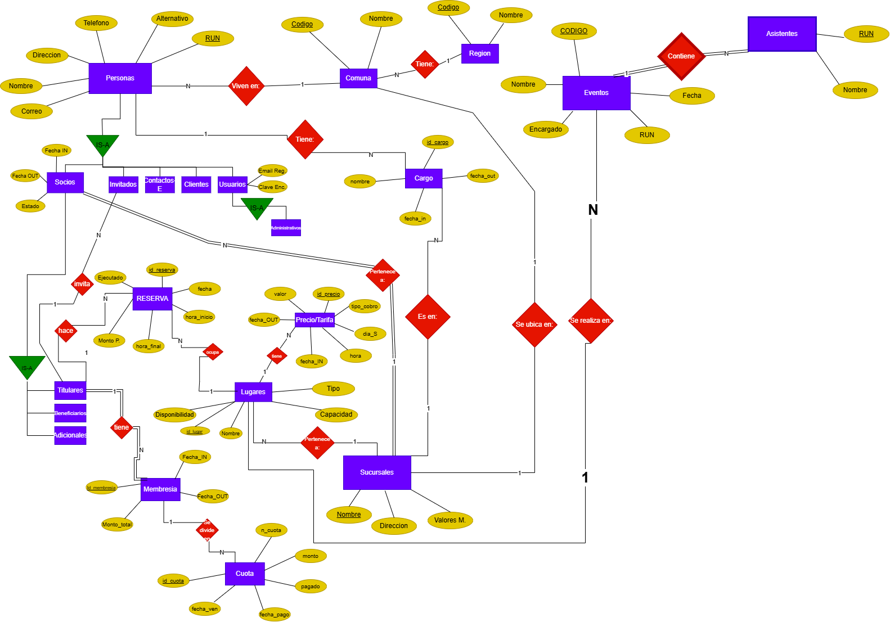

# Informe Entrega 1 - Bases de datos IIC2413

## Datos del Alumno
| **Apellidos**       | **Nombres**          | **Número de Alumno** |
|---------------------|----------------------|----------------------|
| Condori Tembladera | Fabio Tomas    |25663100              |


## 1. Descripción y análisis del problema
 
    (Copiado y pegado desde el enunciado)
	Club Social y Deportivo DCColo le ha solicitado construir una aplicación que gestione
    todas las actividades que el Club realiza en beneficio de sus socios.
    El club tiene socios, los que pagan cuotas mensuales para pertenecer al club y usar sus
    instalaciones. Las actividades que pueden realizar los socios son:
    Arrendar instalaciones para practicar deportes como: básquetbol, fútbol, tenis, pádel,
    natación, atletismo, etc.
    Arrendar cabañas y departamentos que DCColo tiene en distintas ubicaciones del país.
    
    Asistir al restaurant que tiene, donde los socios pueden reservar para desayunar,
    almorzar o cenar.
    Organizar actividades en el centro de eventos, como congresos, planificaciones estratégicas
    o matrimonios.
    Todos los valores de los servicios tienen vigencia, es decir el valor tiene una fecha de
    inicio y termino.
    Además los socios pueden invitar personas externas (que no son socias) para que puedan
    asistir al club y usar sus instalaciones. Las personas que son invitadas deben estar
    registradas previamente y es verificada su identidad antes de su ingreso.
    Los asistentes a eventos o restaurant también se registran pero con datos mínimos
    Como programador Junior, se te otorga la tarea de analizar y construir el modelo entidad
    relación, el esquema relacional y desarrollar consultas SQL a partir de la información y reglas
    de negocio del Club y Social Deportivo DCColo.

## 2. Solución aplicada

    Se utilizo una jerarquia IS-A para poder modelar los distintos tipos de entidades. La entidad PERSONA modela los distintos tipos de personas posibles lo cual lo hace la entidad padre, se eligio RUN como llave primaria ya que es mas facil de distingir frente a los nombres que pueden ser mas extensos. PERSONA contiene los atributos comunes (RUN, nombre, correo, telefono, direccion) y las entidades hijas son SOCIOS, INVITADOS, CLIENTES, CONTACTOS-EMPRESA,USUARIOS. A su vez SOCIOS se divide en TITULARES, BENEFICIARIOS, ADICIONALES. Estas decisiones representan fielmente el rol de cada entidad y evitan redundancia.

    Se modeló RESERVA como entidad independiente en lugar de una relación M:N entre TITULAR y LUGAR, dado que tiene atributos propios relevantes como fecha, hora, monto y estado de 
    ejecución.

    Se separó el precio en una entidad propia porque varía según día, hora y tiene vigencia temporal, lo que impide tratarlo como un simple atributo de LUGAR.

    Se distinguió entre MEMBRESIA (el contrato anual) y CUOTA (cada pago mensual), reflejando la regla de negocio que permite pago total o en 12 cuotas.

    Los cargos se modelaron como entidad separada con vigencia (fecha inicio y término), vinculada a PERSONA y SUCURSAL, permitiendo registrar el historial de cargos y al gerente de cada sucusal. Aunque sucursal y comunda poseen una relacion 1:1 ya que cada comuna posee una unica sucursal, entonces sucursal es la unica entidad que no necesita un id aparte, ya que el nombre se garantiza distinto y unico.

    Dado que el enunciado especifica códigos únicos para ambas, se modelaron como entidades independientes en lugar de simples atributos, permitiendo normalizar la información geográfica.

    Se modeló como entidad débil de EVENTOS porque solo existe en el contexto de un evento, con datos mínimos (RUN y nombre) y llave parcial compuesta con el código del evento.

	
### 2.1 Modelo Entidad Relación



### 2.2 Modelo Entidad Relación normalizado

    El modelo E/R se convirtió a un esquema relacional normalizado en BCNF. Todas las tablas tienen un único determinante que es su llave primaria, sin dependencias parciales ni transitivas. En los casos donde existían dependencias transitivas (como nombre_cargo en PERSONA), se separaron en tablas independientes. Se utilizaron llaves artificiales (SERIAL) cuando ningún atributo natural identificaba unívocamente a la entidad.

Sintaxis: **atributo** indica llave primaria y →TABLA indica llave foránea.

### Personas:
PERSONA (nombre: VARCHAR(100), correo: VARCHAR(100), direccion: VARCHAR(100), telefono: VARCHAR(100), alternativo: VARCHAR(100), **RUN**: VARCHAR(12), cod_comuna→COMUNA: INT)
> Persona está en BCNF porque la dependencia funcional es 
> RUN → todos los argumentos, donde RUN es llave primaria.

### Region:
REGION (**cod_region**: INT, nombre: VARCHAR(100))
> Region está en BCNF porque la dependencia funcional es 
> cod_region → nombre, donde cod_region es llave primaria.

### Comuna:
COMUNA (**cod_comuna**: INT, nombre: VARCHAR(100), cod_region→REGION: INT, nombre_sucursal→SUCURSALES: VARCHAR(100))
> Comuna está en BCNF porque la dependencia funcional es 
> cod_comuna → todos los argumentos, donde cod_comuna es llave primaria.

### Socios:
SOCIOS (**RUN**→PERSONA: VARCHAR(12), Fecha_IN: date, Fecha_OUT: date, estado: VARCHAR(100), nombre_sucursal→SUCURSAL: VARCHAR(100))
> Socios está en BCNF porque la dependencia funcional es 
> RUN → todos los argumentos, donde RUN es llave primaria.

### Contactos-Empresa:
CONTACTOS_EMPRESA (**RUN**→PERSONA: VARCHAR(12))
> Contactos-Empresa está en BCNF porque la dependencia funcional es 
> RUN → todos los argumentos, donde RUN es llave primaria.

### Clientes:
CLIENTES (**RUN**→PERSONA: VARCHAR(12))
> Clientes está en BCNF porque la dependencia funcional es 
> RUN → todos los argumentos, donde RUN es llave primaria.

### Usuarios:
USUARIOS (**RUN**→PERSONA: VARCHAR(12), email_reg: VARCHAR(100), clave_enc: VARCHAR(100))
> Usuarios está en BCNF porque la dependencia funcional es 
> RUN → todos los argumentos, donde RUN es llave primaria.

### Administrativos:
ADMINISTRATIVOS (**RUN**→USUARIOS: VARCHAR(12))
> Administrativos está en BCNF porque la dependencia funcional es 
> RUN → todos los argumentos, donde RUN es llave primaria.

### Invitados:
INVITADOS (**RUN**→PERSONA: VARCHAR(12), nombre_titular→TITULARES: VARCHAR(100))
> Invitados está en BCNF porque la dependencia funcional es 
> RUN → todos los argumentos, donde RUN es llave primaria.

### Titulares:
TITULARES (**RUN**→SOCIOS: VARCHAR(12))
> Titulares está en BCNF porque la dependencia funcional es 
> RUN → todos los argumentos, donde RUN es llave primaria.

### Beneficiarios:
BENEFICIARIOS (**RUN**→SOCIOS: VARCHAR(12))
> Beneficiarios está en BCNF porque la dependencia funcional es 
> RUN → todos los argumentos, donde RUN es llave primaria.

### Titulares:
ADICIONALES (**RUN**→SOCIOS: VARCHAR(12))
> Titulares está en BCNF porque la dependencia funcional es 
> RUN → todos los argumentos, donde RUN es llave primaria.

### Reserva:
RESERVA (**id_reserva**: int, fecha: date, ejecutado: VARCHAR(100), hora_IN: VARCHAR(5), hora_OUT: VARCHAR(5), Monto_P: int, nombre_titular→TITULARES: VARCHAR(100), nombre_lugar→LUGARES: VARCHAR(100))
> Reserva está en BCNF porque la dependencia funcional es 
> id_reserva → todos los argumentos, donde id_reserva es llave primaria.

### Membresia:
MEMBRESIA (**id_membresia**: int, fecha_in: date, fecha_out: date, monto_total: int, nombre_titular→TITULARES)
> Membresia está en BCNF porque la dependencia funcional es 
> id_membresia → todos los argumentos, donde id_membresia es llave primaria.

### Cuota:
CUOTA (**id_cuota**: int, n_cuota: int, monto: int, pagado: bool, fecha_pago: date, fecha_ven: date, id_membresia→MEMBRESIA: int)
> Cuota está en BCNF porque la dependencia funcional es 
> id_cuota → todos los argumentos, donde id_cuota es llave primaria.

### Lugares:
LUGARES (**id_lugar**: int, nombre: VARCHAR(100), tipo: VARCHAR(100), disponibilidad: VARCHAR(100), capacidad: int, nombre_sucursal→SUCURSAL: VARCHAR(100))
> Lugares está en BCNF porque la dependencia funcional es 
> id_lugar → todos los argumentos, donde id_lugar es llave primaria.

### Sucursales:
SUCURSALES (**Nombre**: VARCHAR(100), direccion: VARCHAR(100), Valores_M:int)
> Sucursales está en BCNF porque la dependencia funcional es 
> Nombre → todos los argumentos, donde Nombre es llave primaria.

### Precio/tarifa:
PRECIO/TARIFA (**id_precio**: int, valor: int, dia_semana: VARCHAR(10), tipo_cobro: VARCHAR(10), fecha_in: date, fecha_out: date, hora: VARCHAR(5), nombre_lugar→LUGARES: VARCHAR(100))
> Precio/Tarifa está en BCNF porque la dependencia funcional es 
> id_precio → todos los argumentos, donde id_precio es llave primaria.

### Cargo:
CARGO (**id_cargo**: int, nombre: VARCHAR(100), fecha_in: date, fecha_out: date, nombre_sucursal→SUCURSALES: VARCHAR(100), run_persona→PERSONA: VARCHAR(12))
> Cargo está en BCNF porque la dependencia funcional es 
> id_gargo → todos los argumentos, donde id_cargo es llave primaria.

### Eventos:
EVENTOS (**codigo**: int, nombre: VARCHAR(100), encargado: VARCHAR(100), RUN_encargado: VARCHAR(12), fecha: date)
> Eventos está en BCNF porque la dependencia funcional es 
> codigo → todos los argumentos, donde codigo es llave primaria.

### Asistentes:
ASISTENTES (**codigo**→EVENTOS: int, **run**: VARCHAR(12), nombre: VARCHAR(100))
> Asistentes está en BCNF porque la dependencia funcional es 
> codigo,run → todos los argumentos, donde codigo es llave compuesta.

### 2.3 Consultas SQL

#### 
    a) Despliegue (como un listado) la agenda de la sucursal ”Santa Cruz”para la semana que comienza el 6 de abril 2026, indicando el dia, la fecha, la hora y el evento o nombre del socio que tiene reservado cada lugar. El listado debe estar Agrupado por día, hora y lugar
```sql
SELECT 
    TO_CHAR(r.fecha, 'Day') AS dia,
    r.fecha,
    r.hora_IN AS hora,
    l.nombre AS lugar,
    p.nombre AS socio_o_evento
FROM RESERVA r
JOIN LUGARES l ON r.id_lugar = l.id_lugar
JOIN SUCURSALES s ON l.id_sucursal = s.id_sucursal
JOIN TITULARES t ON r.RUN_titular = t.RUN
JOIN PERSONA p ON t.RUN = p.RUN
WHERE s.nombre = 'Santa Cruz'
  AND r.fecha BETWEEN '2026-04-06' AND '2026-04-12'

UNION ALL

SELECT 
    TO_CHAR(e.fecha, 'Day') AS dia,
    e.fecha,
    NULL AS hora,
    l.nombre AS lugar,
    e.nombre AS socio_o_evento
FROM EVENTOS e
JOIN LUGARES l ON e.id_lugar = l.id_lugar
JOIN SUCURSALES s ON l.id_sucursal = s.id_sucursal
WHERE s.nombre = 'Santa Cruz'
  AND e.fecha BETWEEN '2026-04-06' AND '2026-04-12'

ORDER BY dia, hora, lugar;
```
####
    b) Calcule y despliegue el monto del ingreso mensual (mes actual) por concepto de membresías, reservas ejecutadas y eventos de la misma sucursal agrupados por ingresos efectivamente recibidos e ingresos futuros esperados.
``` sql
SELECT 
    'Recibido' AS tipo_ingreso,
    SUM(CASE WHEN c.pagado = TRUE THEN c.monto ELSE 0 END) AS membresias,
    SUM(CASE WHEN r.ejecutado = TRUE THEN r.Monto_P ELSE 0 END) AS reservas,
    SUM(CASE WHEN e.fecha <= CURRENT_DATE THEN e.monto_pagado ELSE 0 END) AS eventos
FROM SUCURSALES s
LEFT JOIN SOCIOS so ON so.id_sucursal = s.id_sucursal
LEFT JOIN TITULARES t ON t.RUN = so.RUN
LEFT JOIN MEMBRESIA m ON m.RUN_titular = t.RUN
LEFT JOIN CUOTA c ON c.id_membresia = m.id_membresia
LEFT JOIN RESERVA r ON r.RUN_titular = t.RUN
LEFT JOIN EVENTOS e ON e.id_lugar IN (
    SELECT id_lugar FROM LUGARES WHERE id_sucursal = s.id_sucursal
)
WHERE s.nombre = 'Santa Cruz'
  AND EXTRACT(MONTH FROM c.fecha_ven) = EXTRACT(MONTH FROM CURRENT_DATE)
  AND EXTRACT(YEAR FROM c.fecha_ven) = EXTRACT(YEAR FROM CURRENT_DATE)

UNION ALL

SELECT 
    'Esperado' AS tipo_ingreso,
    SUM(CASE WHEN c.pagado = FALSE THEN c.monto ELSE 0 END) AS membresias,
    SUM(CASE WHEN r.ejecutado = FALSE THEN r.Monto_P ELSE 0 END) AS reservas,
    SUM(CASE WHEN e.fecha > CURRENT_DATE THEN e.monto_pagado ELSE 0 END) AS eventos
FROM SUCURSALES s
LEFT JOIN SOCIOS so ON so.id_sucursal = s.id_sucursal
LEFT JOIN TITULARES t ON t.RUN = so.RUN
LEFT JOIN MEMBRESIA m ON m.RUN_titular = t.RUN
LEFT JOIN CUOTA c ON c.id_membresia = m.id_membresia
LEFT JOIN RESERVA r ON r.RUN_titular = t.RUN
LEFT JOIN EVENTOS e ON e.id_lugar IN (
    SELECT id_lugar FROM LUGARES WHERE id_sucursal = s.id_sucursal
)
WHERE s.nombre = 'Santa Cruz'
  AND EXTRACT(MONTH FROM c.fecha_ven) = EXTRACT(MONTH FROM CURRENT_DATE)
  AND EXTRACT(YEAR FROM c.fecha_ven) = EXTRACT(YEAR FROM CURRENT_DATE);
```
####
    c) Extraiga un reporte de todos los socios con sus cuotas atrasadas (membresías y adicionales) incluyendo nombre completo, RUN, sucursal, monto y número de cuotas.
``` sql
SELECT 
    p.nombre AS nombre_completo,
    p.RUN,
    s.nombre AS sucursal,
    SUM(c.monto) AS monto_total,
    COUNT(c.id_cuota) AS numero_cuotas_atrasadas
FROM CUOTA c
JOIN MEMBRESIA m ON c.id_membresia = m.id_membresia
JOIN TITULARES t ON m.RUN_titular = t.RUN
JOIN SOCIOS so ON t.RUN = so.RUN
JOIN PERSONA p ON so.RUN = p.RUN
JOIN SUCURSALES s ON so.id_sucursal = s.id_sucursal
WHERE c.pagado = FALSE
  AND c.fecha_ven < CURRENT_DATE
GROUP BY p.nombre, p.RUN, s.nombre
ORDER BY numero_cuotas_atrasadas DESC;
```
####
    d) Genere el listado de todos los beneficiarios-hijos y datos de su socio titular que en la próxima renovación de la membresía deben pagar un costo adicional (cumplen 29 años). Los datos de los beneficiarios y del socio deben ser RUN, nombre completo, correo, teléfono celular en una sola línea por beneficiario.
``` sql
SELECT 
    pb.RUN AS RUN_beneficiario,
    pb.nombre AS nombre_beneficiario,
    pb.correo AS correo_beneficiario,
    pb.telefono AS telefono_beneficiario,
    pt.RUN AS RUN_titular,
    pt.nombre AS nombre_titular,
    pt.correo AS correo_titular,
    pt.telefono AS telefono_titular
FROM BENEFICIARIOS b
JOIN PERSONA pb ON b.RUN = pb.RUN
JOIN TITULARES t ON b.RUN_titular = t.RUN
JOIN PERSONA pt ON t.RUN = pt.RUN
JOIN MEMBRESIA m ON m.RUN_titular = t.RUN
WHERE EXTRACT(YEAR FROM AGE(m.fecha_out, pb.fecha_nacimiento)) = 29
  AND m.fecha_out >= CURRENT_DATE
ORDER BY pb.nombre;
```
####
    e) Genere un reporte para del año 2025 de todas las sucursales incluyendo nombre de la sucursal, gerente a cargo, ingresos totales de la sucursal y porcentaje del total del Club Social y Deportivo DCColo del a˜no 2025, ordenado de mayor a menor por ingreso.
``` sql
WITH ingresos_sucursal AS (
    SELECT 
        s.id_sucursal,
        s.nombre AS nombre_sucursal,
        COALESCE(SUM(c.monto), 0) +
        COALESCE(SUM(r.Monto_P), 0) +
        COALESCE(SUM(e.monto_pagado), 0) AS ingreso_total
    FROM SUCURSALES s
    LEFT JOIN SOCIOS so ON so.id_sucursal = s.id_sucursal
    LEFT JOIN TITULARES t ON t.RUN = so.RUN
    LEFT JOIN MEMBRESIA m ON m.RUN_titular = t.RUN
    LEFT JOIN CUOTA c ON c.id_membresia = m.id_membresia
        AND EXTRACT(YEAR FROM c.fecha_pago) = 2025
        AND c.pagado = TRUE
    LEFT JOIN RESERVA r ON r.RUN_titular = t.RUN
        AND EXTRACT(YEAR FROM r.fecha) = 2025
        AND r.ejecutado = TRUE
    LEFT JOIN LUGARES l ON l.id_sucursal = s.id_sucursal
    LEFT JOIN EVENTOS e ON e.id_lugar = l.id_lugar
        AND EXTRACT(YEAR FROM e.fecha) = 2025
    GROUP BY s.id_sucursal, s.nombre
),
total_club AS (
    SELECT SUM(ingreso_total) AS total FROM ingresos_sucursal
),
gerentes AS (
    SELECT 
        ca.id_sucursal,
        p.nombre AS gerente
    FROM CARGO ca
    JOIN PERSONA p ON ca.RUN_persona = p.RUN
    WHERE ca.nombre = 'Gerente'
      AND ca.fecha_in <= '2025-12-31'
      AND (ca.fecha_out >= '2025-01-01' OR ca.fecha_out IS NULL)
)
SELECT 
    i.nombre_sucursal,
    g.gerente,
    i.ingreso_total,
    ROUND((i.ingreso_total * 100.0 / t.total), 2) AS porcentaje_total
FROM ingresos_sucursal i
JOIN total_club t ON TRUE
LEFT JOIN gerentes g ON g.id_sucursal = i.id_sucursal
ORDER BY i.ingreso_total DESC;
```


## 3. Referencias y bibliografía externa
No se uso material externo a lo sugerido por el enunciado (drawio).